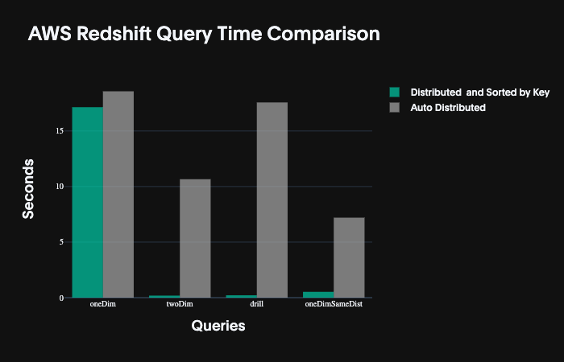
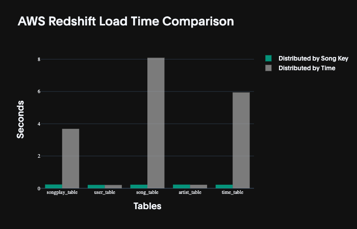
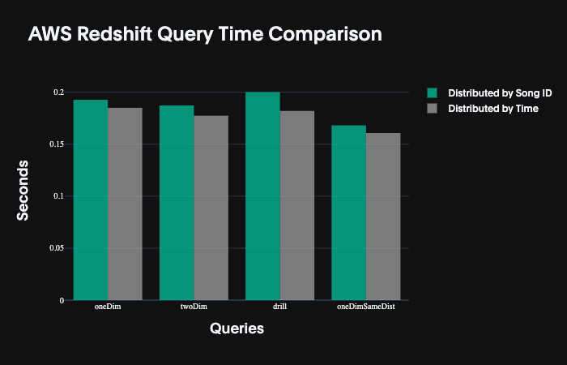

# Sparkify Music Streaming Data Warehouse

This project builds an ETL pipeline that extracts data from two AWS S3 buckets, stages them in Redshift, and transforms them into a set of fact and dimensional tables to be used for analytical processing. 

---


## Project Datasets
There are two datasets that reside in AWS S3 buckets to be combined for our data warehouse. Each are stored as `*.json` files in a folder hierachy related to either songs or dates.

### _Song Dataset_
The first dataset is a subset of real data from the Million Song Dataset. Each file is in JSON format and contains metadata about a song and the artist of that song. The files are partitioned by the first three letters of each song's track ID. For example, here are filepaths to two files in this dataset.

```
song_data/A/B/C/TRABCEI128F424C983.json
song_data/A/A/B/TRAABJL12903CDCF1A.json
```

And below is an example of what a single song file, TRAABJL12903CDCF1A.json, looks like.

```
{"num_songs": 1, "artist_id": "ARJIE2Y1187B994AB7", "artist_latitude": null, "artist_longitude": null, "artist_location": "", "artist_name": "Line Renaud", "song_id": "SOUPIRU12A6D4FA1E1", "title": "Der Kleine Dompfaff", "duration": 152.92036, "year": 0}
```
### _Log Dataset_
The second dataset consists of log files in JSON format generated by this event simulator based on the songs in the dataset above. These simulate app activity logs from an imaginary music streaming app based on configuration settings.

The log files in the dataset you'll be working with are partitioned by year and month. For example, here are filepaths to two files in this dataset.
```
log_data/2018/11/2018-11-12-events.json
log_data/2018/11/2018-11-13-events.json
```

And below is an example of what the data in a log file, 2018-11-12-events.json, looks like.


 ### _Project Components_

The project in this repository includes three files used to build the final Data Warehouse and one folder to illustrate testing:

- `create_table.py` will delete all tables from tables form Redshift and subsequently build fact and dimensional tables in a star schema in Redshift.

- `etl.py` will extract data from an S3 bucket, transform it for our analytical purposes and load it into our new Redshift db.

- `sql_queries.py` contains all Redshirt queries to be executed in the process.

- `testing/` is where you'll find alternative trial processes and results for each which lead to the final setup of the dimensional tables.
 
### _Installation and Operation_

1. Launch a Redshift instance on AWS noting the following configurations to connect:
    - HOST
    - DB_NAME
    - DB_USER
    - DB_PASSWORD
    - DB_PORT
    - ARN

     _(and your personal the KEY and SECRET needed to connect to your AWS account)_

2. Add these parameters to the dwh.cfg file in the same directory. This will mask your login credentials to public repositories. DO NOT PUSH THIS FILE TO A PUBLIC REPOSITORY. Add `*.cfg` to the .gitignore file so that it will be ignored by git if you continue to use the same processes to mask credentials.
3. In a terminal window within the same directory as your `dwh.cfg` file and the `sql_queries.py` file run the following command at the prompt:
    - `python create_tables.py && python etl.py`

---

# Process to Determine Optimal Fact and Dimensional Schema
To begin, I have looked at the volume of data to be loaded into our Fact and Dimensional tables. Working in Redshift, we know that the database works as a 'Massively Parallel Process' and that our tables will be partitioned both in processing and storage. To minimize shuffling across partitions we need to look for smaller tables that can be replicated across all partitions and find larger tables than can be distributed across each partition.

### Current length of each type of information in our S3 data source
- songplays = 1998
- songs = 89,376
- artists = 60,150
- users = 624

While songplay is small for this project, common sense tells us it will get much larger in practice. 

We need to find a balance of load times versus query times that best suit our needs. Our queries will be determined by our analytical needs and must remain flexible for further customization, but we can optomize our tables to be efficient for the most common query types given the data.

### Additional Considerations 

Constraints on columns in our table will help proect us from bad data. Many columns have been tested with the current data to be certain items are not empty. 

- **VARCHAR LIMITS** In researching other databases, I found many used Byte limits for Varchar constraints. After some research I found [convincing advice](https://dba.stackexchange.com/questions/20974/should-i-add-an-arbitrary-length-limit-to-varchar-columns) to forego any limits.
- **NOT NULL** Using some assumptions I have added constraints on certain columns and tables to restrict entries that do not contain data in fields. These are my own assumptions and in a real project would be informed by other teams and engineers building apps collecting and using the data. 

--- 

# Testing

To determine the best method of distributing our tables in our Redshift database I will test serveral table styles. To begin, I have created 4 different queries that will join several tables of the database and may require some shuffling between partitions.

## Queries

_Query 1 - Find users that listen on the Weekend._
```
SELECT sp.user_id, u.first_name, u.last_name, sum(st.duration) as total_time
FROM songplay sp
JOIN userTable u ON sp.user_id = u.user_id
JOIN songTable st ON sp.song_id = st.song_id
JOIN timeTable t ON sp.start_time = t.start_time
WHERE t.weekday = 5 OR t.weekday = 6
GROUP BY 1, 2, 3
ORDER by 4;
```
 
- _Sample result_

|    |   user_id | first_name   | last_name   |   total_time |
|---:|----------:|:-------------|:------------|-------------:|
|  0 |        90 | Andrea       | Butler      |      58.8796 |
|  1 |        71 | Ayleen       | Wise        |     130.821  |
|  2 |        42 | Harper       | Barrett     |     148.192  |
|  3 |        97 | Kate         | Harrell     |     165.59   |
|  4 |        83 | Stefany      | White       |     181.211  |


_Query 2 - Which artists are played the most by Free accounts?_
* Perhaps we could use this to either limit or promote certain artists.
```
SELECT sp.artist_id, a.name, sum(st.duration)
FROM songplay sp
JOIN songTable st ON sp.song_id = st.song_id
JOIN artistTable a ON sp.artist_id = a.artist_id
WHERE sp.level = 'free'
GROUP BY 1, 2
ORDER BY 3 DESC
```

- _Sample result_

|    | artist_id          | name                           |      sum |
|---:|:-------------------|:-------------------------------|---------:|
|  0 | AR5E44Z1187B9A1D74 | Dwight Yoakam                  | 1914.46  |
|  1 | ARD46C811C8A414F3F | Kid Cudi                       |  919.796 |
|  2 | ARD46C811C8A414F3F | Kid Cudi / Kanye West / Common |  919.796 |
|  3 | ART5MUE1187B98C961 | Metallica                      |  830.327 |
|  4 | AR5EYTL1187B98EDA0 | Lonnie Gordon                  |  724.844 |


_Query 3 - Which artists are played each hour?_
* Perhaps there is some correlation here that could help adjust our prediction algo when making playlists to match time of day.
```
SELECT sp.artist_id, a.name, AVG(t.hour) as Avg_Start_Hour, sum(st.duration) as Total_listen_time
FROM songplay sp
JOIN songTable st ON sp.song_id = st.song_id
JOIN artistTable a ON sp.artist_id = a.artist_id
JOIN timeTable t ON sp.start_time = t.start_time
WHERE sp.level = 'free'
AND st.year < 2017
AND t.month IN (11)
GROUP BY 1, 2
ORDER BY 4 DESC;
```
- _Sample result_

|    | artist_id          | name                           |   avg_start_hour |   total_listen_time |
|---:|:-------------------|:-------------------------------|-----------------:|--------------------:|
|  0 | AR5E44Z1187B9A1D74 | Dwight Yoakam                  |               15 |            1914.46  |
|  1 | ARD46C811C8A414F3F | Kid Cudi / Kanye West / Common |               13 |             919.796 |
|  2 | ARD46C811C8A414F3F | Kid Cudi                       |               13 |             919.796 |
|  3 | ART5MUE1187B98C961 | Metallica                      |               16 |             830.327 |
|  4 | AR5EYTL1187B98EDA0 | Lonnie Gordon                  |               15 |             724.844 |


_Query 4 - Find locations where users tend to use for free_ 
* Perhaps local marketing could increase in these areas to boost paid memberships
```
SELECT sp.start_time, u.level, sp.location
FROM songplay sp
JOIN userTable u ON sp.user_id = u.user_id
WHERE sp.location IS NOT NULL
order by 1
```
 
- _Sample result_

|    | start_time                 | level   | location                                     |
|---:|:---------------------------|:--------|:---------------------------------------------|
|  0 | 2018-11-01 21:11:13.796000 | free    | Phoenix-Mesa-Scottsdale, AZ                  |
|  1 | 2018-11-02 16:35:00.796000 | free    | New Haven-Milford, CT                        |
|  2 | 2018-11-02 17:31:45.796000 | free    | Washington-Arlington-Alexandria, DC-VA-MD-WV |
|  3 | 2018-11-02 18:02:42.796000 | free    | New Haven-Milford, CT                        |
|  4 | 2018-11-02 18:36:53.796000 | free    | Columbia, SC                                 |

## First Test 

- There was not a great discrepancy in load times for our data to between the distributed table and the auto distributed table.  I ran this process multiple times, unfortunately with such small data, I received varying results each time the data was loaded. Leading me to beleive that most of the differences are due not to the architecture of the tables, but network traffic and perhaps some caching.


_Load times for Distributed & Sorted Key versus a Redshift Auto distribution._

- However, there were fairly consistent differences in query times between the two schemas. This chart above represents the most extreme result. In a more real world project with a larger test data set, I would expect to see more consitent results. 



_Query times for each of our 4 sample queries on the two schema styles._

## Second Test 
Given our test 1 showed promising results for Distributed and sorted Keys. Next we will perform a second test to check the performance of varying our dist and sort keys for our sample queries. 

- Load times for our data appear to be considerably longer when we are looking to distribute the data in each partition by time. This is a result that should be met with skeptism as our songplay data is currently one of the smaller groups of data highlighted above.



_Distributed and Sorted Key load time on Song Id versus Song Play time in Redshift_

- Query times in our second test were relatively similar.



_Query times for each of our 4 sample queries on the two schema styles._


## Result

Given our intentionally distributed Schema preformed better than auto distrobution and our SongKey distrobution had similar results as time based distobution but much better load times. It seems our schema would be best distributed and sorted by SongKey. 

---

!!! I will use these results to prepare the Redshift tables for this project, but it looks probably that the results are showing other factors in query and load time. With more data and longer tasks these test may product much different results. Outside of project work I would increase the sample data to further test the results. The point here is to show how I might go about testing for efficiency.!!! 

