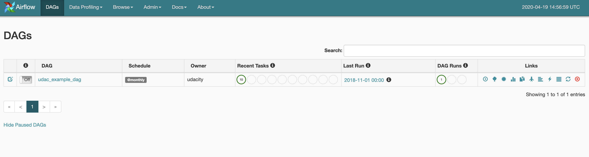
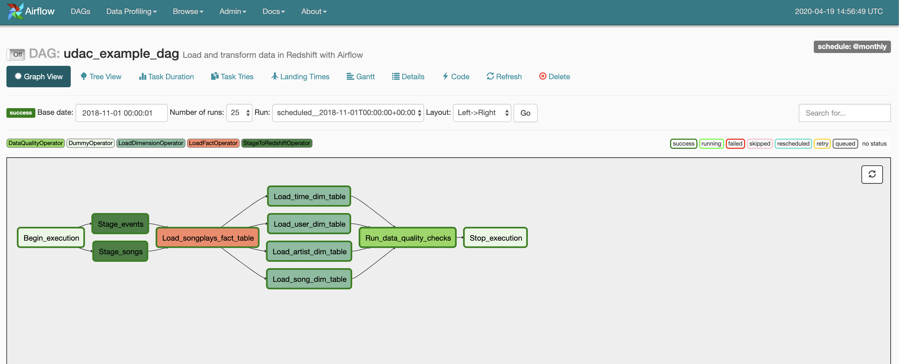
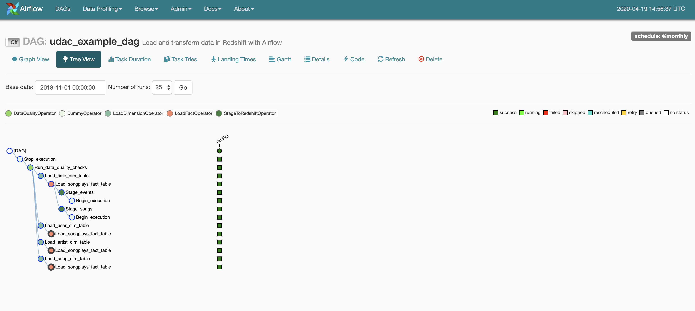
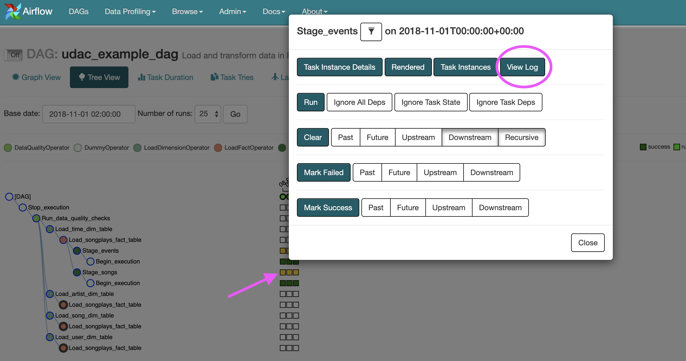

# UDACITY DATA ENGINEERING NANODEGREE
# PROJECT 5 - Data Pipelines with Apache Airflow
---
## Introduction

This repository contains files for the Udacity Data Engineering Nanodegree class project.

A fictional music streaming startup, Sparkify, has decided that it is time to introduce more automation and monitoring to their data warehouse ETL pipelines and have come to the conclusion that the best tool to achieve this is Apache Airflow. Their data resides in S3, in a directory of JSON logs on user activity on the app, as well as a directory with JSON metadata on the songs in their app. 

This project will build an Airflow workflow to stage, transform, load and validate the data for analysis on an hourly basis.

## Project Description

Create an Apache Airflow Directed Acyclical Graph to automate and monitor the ETL process of the Sparkify data pipeline. This project will require custom operators to perform tasks such as staging data, filling the data warehouse, and running checks on the data as the final step.

### _Song Dataset_

The first dataset is a subset of real data from the Million Song Dataset. Each file is in JSON format and contains metadata about a song and the artist of that song. The files are partitioned by the first three letters of each song's track ID. For example, here are filepaths to two files in this dataset.

```
song_data/A/B/C/TRABCEI128F424C983.json
song_data/A/A/B/TRAABJL12903CDCF1A.json
```

And below is an example of what a single song file, TRAABJL12903CDCF1A.json, looks like.

```
{"num_songs": 1, "artist_id": "ARJIE2Y1187B994AB7", "artist_latitude": null, "artist_longitude": null, "artist_location": "", "artist_name": "Line Renaud", "song_id": "SOUPIRU12A6D4FA1E1", "title": "Der Kleine Dompfaff", "duration": 152.92036, "year": 0}
```
### _Log Dataset_

The second dataset consists of log files in JSON format generated by this event simulator based on the songs in the dataset above. These simulate app activity logs from an imaginary music streaming app based on configuration settings.

The log files in the dataset you'll be working with are partitioned by year and month. For example, here are filepaths to two files in this dataset.
```
log_data/2018/11/2018-11-12-events.json
log_data/2018/11/2018-11-13-events.json
```

And below is an example of what the data in a log file, 2018-11-12-events.json, looks like.


## Project Components

The project in this repository requires an Airflow dag file, 4 custom operator files and a helper file of SQL queries:

#### dags/ 

- `udac_example_dag.py` is the core of the workflow with all Dag paramaters, tasts and workflow.  

#### plugins/ 

##### operators/ 

- `stage_redshift.py` Custom Airflow operator class to be used to connect S3 data files to AWS Redshift

- `load_fact.py` Custom Airflow operator class to transform data from a staging table to a fact table for analysis

- `load_dimension.py` Custom Airflow operator class to transform data from a staging table to a dimensional table for analysis

- `data_quality.py` Custom Airflow operator class to test Redshift tables for consistency and accuracy. This important step will test that each analysis table has been created, that it contains rows of data and that the last row in each table contains 0 null values. 

##### helpers/ 
- `sql_queries.py` A Store of SQL query string varibales to be used in the ETL process. 

#### additional 

- `create_tables.sql` - This is a list of 7 SQL queries to create all the tables needed for this Data Warehouse. 

## _Installation and Operation_ 

*Requirements*: 

- AWS Redshift cluster running and access to the connection credientials 
    - !! Use your favorite SQL client or the AWS redshift console editor to create the tables needed for this data warehouse
        - `create_tables.sql` file in this repository will have all the necessary queries. 
- Access to s3 bucket with source data through an account Access Key or IAM role permissions from an EC2 instance.

From the terminal of the computer or instance you will use to run this pipeline: 

1. First set an environment variable for the folder of this repository: 

    `export AIRFLOW_HOME=~/airflow/<sparkify or your folder of choice here>`

2. Instal Apache Airflow [inside an virtual environment is perferred]: 

    `pip install apache-airflow`

3. Initialize Airflow and a simple SQLlite DB to store process compoents:

    `airflow initdb`

    - This should run error free. Diagnose any error messages here.

4. Start the webserver to use Airflow UI

    `airflow webserver -p 8080` 
    
    - This will continue to run in the terminal window while Airflow is running. 
    - Notice any errors and debug before proceding

5. In a new terminal window, start the Airflow Scheduler

    `airflow scheduler`


6. Open `localhost:8080` in a browser and look for the proect dag `udac_example_dag.py`

### _Setting Connections_

1. In the Airflow UI in the browser you will need to establish connections to access AWS S3 and the target AWS Redshift DB. 

2. Click on the Admin tab and select Connections.

3. Under Connections, select Create.

4. On the create connection page, enter the following values:

 - **Conn Id**: Enter `aws_credentials`.
 - **Conn Type**: Enter `Amazon Web Services`.
 - **Login**: Enter your **Access key ID** from the IAM User credentials you have established.
 - **Password**: Enter your **Secret access key** from the IAM User credentials you have established.
 
Once you've entered these values, select **Save and Add Another**.


5. On the next create connection page, enter the following values:


- **Conn Id**: Enter `redshift`.
- **Conn Type**: Enter `Postgres`.
- **Host**: Enter the endpoint of your Redshift cluster, excluding the port at the end. You can find this by selecting your cluster in the **Clusters** page of the Amazon Redshift console. IMPORTANT: Make sure to **NOT** include the port at the end of the Redshift endpoint string.
- **Schema**: Enter the name of the the Redshift database you want to connect to.
- **Login**: Enter username to the DB.
- **Password**: Enter the password you created when launching your Redshift cluster.
- **Port**: Enter 5439.

Once you've entered these values, select **Save**.

6. Find `udac_example_dag` in the list of DAGS and toggle the switch to `ON`.



7. Check to see that the tasks are running! 


---
### Output

From the Airflow UI in your Browser you should see the flowing:

First under the Graph View of this DAG to be sure the work flow will be processed in the correct order: 



Next check the tree view of the DAG to monitor processes running successfully:



Should any task fail. Operations have been logged and you may view individual logs for each task by clicking the individual squares: 




# Schema for Song Play Analysis
Loaded into Redshift are fact and dimensional tables in a star schema optimized for queries on song play analysis.

This includes the following tables.

**Fact Table**
1. songplays - records in log data associated with song plays i.e. records with page NextSong
    - songplay_id, start_time, user_id, level, song_id, artist_id, session_id, location, user_agent

**Dimension Tables**

2. users - users in the app
    - *user_id, first_name, last_name, gender, level*
3. songs - songs in music database
    - *song_id, title, artist_id, year, duration*
4. artists - artists in music database
    - *artist_id, name, location, lattitude, longitude*  
5. time - timestamps of records in **songplays** broken down into specific units
    - *start_time, hour, day, week, month, year, weekday*

# Schedule and Settings

Currently this workflow will:

- perform a run for every **hour** from our start date
- Should a single task fail, the workflow will 
  - pause for **5 minute**
  - retry **three times** before the DAG will **fail**
- not depend on past runs
- not email on retry 

The current start date is set to the beginning of the data in our logs and will increment ahead by one hour until it catches the present. 

```
default_args = {
    'owner': 'udacity',
    'start_date': datetime(2018, 11, 1),    # <---- Backfill from this date and run perpetually each hour going foward. 
    'depends_on_past': False,
    'email': ['airflow@example.com'],
    'email_on_failure': False,
    'email_on_retry': False,
    'retries': 3,                           # <---- Adjust number of retries
    'retry_delay': timedelta(minutes=5),    # <---- Adjust retry delay period
    'catchup': False,
}

dag = DAG('udac_example_dag',
          default_args=default_args,
          description='Load and transform data in Redshift with Airflow',
          schedule_interval='@hourly',      # <---- Adjust to @daily, @monthly, or another period in chrontask format ('* * * * *')
          max_active_runs=5,                # <---- Number of Dags to be running simultaneously
          )
```


## Author 

Derrick Lewis - http://www.derrickjameslewis.com
