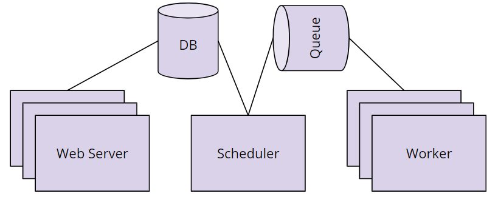
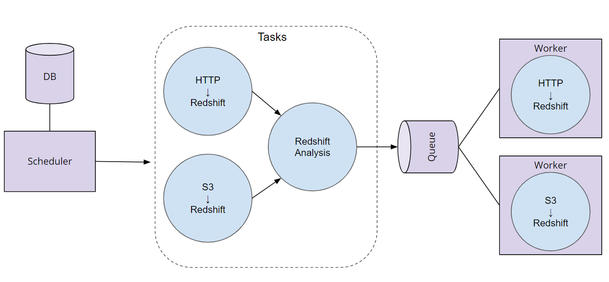

# Data Pipelines with Apache Airflow

**Defining New Terms**

The video above includes references to a few terms that you may not be familiar with. Below are some definitions that you might find useful.

**Extract Transform Load (ETL) and Extract Load Transform (ELT):**

"ETL is normally a continuous, ongoing process with a well-defined workflow. ETL first extracts data from homogeneous or heterogeneous data sources. Then, data is cleansed, enriched, transformed, and stored either back in the lake or in a data warehouse.

"ELT (Extract, Load, Transform) is a variant of ETL wherein the extracted data is first loaded into the target system. Transformations are performed after the data is loaded into the data warehouse. ELT typically works well when the target system is powerful enough to handle transformations. Analytical databases like Amazon Redshift and Google BigQ."
Source: [Xplenty.com](https://www.xplenty.com/blog/etl-vs-elt/)

This [Quora post](https://www.quora.com/What-is-the-difference-between-the-ETL-and-ELT) is also helpful if you'd like to read more.

**What is S3?**

"Amazon S3 has a simple web services interface that you can use to store and retrieve any amount of data, at any time, from anywhere on the web. It gives any developer access to the same highly scalable, reliable, fast, inexpensive data storage infrastructure that Amazon uses to run its own global network of web sites."
Source: [Amazon Web Services Documentation](https://docs.aws.amazon.com/AmazonS3/latest/dev/Welcome.html).

If you want to learn more, start [here](https://docs.aws.amazon.com/AmazonS3/latest/dev/Welcome.html).

**What is Kafka?**

"Apache Kafka is an open-source stream-processing software platform developed by Linkedin and donated to the Apache Software Foundation, written in Scala and Java. The project aims to provide a unified, high-throughput, low-latency platform for handling real-time data feeds. Its storage layer is essentially a massively scalable pub/sub message queue designed as a distributed transaction log, making it highly valuable for enterprise infrastructures to process streaming data."
Source: Wikipedia.

If you want to learn more, start [here](https://kafka.apache.org/intro).

**What is RedShift?**

"Amazon Redshift is a fully managed, petabyte-scale data warehouse service in the cloud. You can start with just a few hundred gigabytes of data and scale to a petabyte or more... The first step to create a data warehouse is to launch a set of nodes, called an Amazon Redshift cluster. After you provision your cluster, you can upload your data set and then perform data analysis queries. Regardless of the size of the data set, Amazon Redshift offers fast query performance using the same SQL-based tools and business intelligence applications that you use today.

If you want to learn more, start [here](https://docs.aws.amazon.com/redshift/latest/mgmt/welcome.html).

So in other words, S3 is an example of the final data store where data might be loaded (e.g. ETL). While Redshift is an example of a data warehouse product, provided specifically by Amazon.


Definitions

- **Directed Acyclic Graphs (DAGs):** DAGs are a special subset of graphs in which the edges between nodes have a specific direction, and no cycles exist. When we say “no cycles exist” what we mean is the nodes cant create a path back to themselves.
- **Nodes:** A step in the data pipeline process.
- **Edges**: The dependencies or relationships other between nodes.
---

## Apache Airflow

"Airflow is a platform to programmatically author, schedule and monitor workflows. Use airflow to author workflows as directed acyclic graphs (DAGs) of tasks. The airflow scheduler executes your tasks on an array of workers while following the specified dependencies. Rich command line utilities make performing complex surgeries on DAGs a snap. The rich user interface makes it easy to visualize pipelines running in production, monitor progress, and troubleshoot issues when needed. When workflows are defined as code, they become more maintainable, versionable, testable, and collaborative."

If you'd like to learn more, start [here](https://airflow.apache.org/).


`exercise1.py`

**Callables** can also be thought of as passing functions that can be included as arguments to other functions. Examples of callables are map, reduce, filter. This is a pretty powerful feature of python you can explore more using the resources below. Callables are examples of functional programming that is introduced in an earlier lesson.

Here is the link to the [Python documentation on callables](https://docs.python.org/3.4/library/functools.html).

**Components of Airflow**




- **Scheduler** orchestrates the execution of jobs on a trigger or schedule. The Scheduler chooses how to prioritize the running and execution of tasks within the system. You can learn more about the Scheduler from the official [Apache Airflow documentation.](https://airflow.apache.org/scheduler.html)

- **Work Queue** is used by the scheduler in most Airflow installations to deliver tasks that need to be run to the Workers.
- **Worker** processes execute the operations defined in each DAG. In most Airflow installations, workers pull from the work queue when it is ready to process a task. When the worker completes the execution of the task, it will attempt to process more work from the work queue until there is no further work remaining. When work in the queue arrives, the worker will begin to process it.
- **Database** saves credentials, connections, history, and configuration. The database, often referred to as the metadata database, also stores the state of all tasks in the system. Airflow components interact with the database with the Python ORM, [SQLAlchemy](https://www.sqlalchemy.org/).
- **Web Interface** provides a control dashboard for users and maintainers. Throughout this course you will see how the web interface allows users to perform tasks such as stopping and starting DAGs, retrying failed tasks, configuring credentials, The web interface is built using the [Flask web-development microframework.](http://flask.pocoo.org/)

**How Airflow Works**



**Order of Operations For an Airflow DAG**

- The Airflow Scheduler starts DAGs based on time or external triggers.
- Once a DAG is started, the Scheduler looks at the steps within the DAG and determines which steps can run by looking at their dependencies.
- The Scheduler places runnable steps in the queue.
- Workers pick up those tasks and run them.
- Once the worker has finished running the step, the final status of the task is recorded and additional tasks are placed by the scheduler until all tasks are complete.
- Once all tasks have been completed, the DAG is complete.


**Operators**
Operators define the atomic steps of work that make up a DAG. Airflow comes with many Operators that can perform common operations. Here are a handful of common ones:

- `PythonOperator`
- `PostgresOperator`
- `RedshiftToS3Operator`
- `S3ToRedshiftOperator`
- `BashOperator`
- `SimpleHttpOperator`
- `Sensor`

**Task Dependencies**

In Airflow DAGs:

- Nodes = Tasks
- Edges = Ordering and dependencies between tasks

Task dependencies can be described programmatically in Airflow using `>>` and `<<`

- a `>>` b means a comes before b
- a `<<` b means a comes after b

```
hello_world_task = PythonOperator(task_id=’hello_world’, ...)
goodbye_world_task = PythonOperator(task_id=’goodbye_world’, ...)
...
# Use >> to denote that goodbye_world_task depends on hello_world_task
hello_world_task >> goodbye_world_task

```


Tasks dependencies can also be set with “set_downstream” and “set_upstream”
```
a.set_downstream(b) means a comes before b
a.set_upstream(b) means a comes after b
hello_world_task = PythonOperator(task_id=’hello_world’, ...)
goodbye_world_task = PythonOperator(task_id=’goodbye_world’, ...)
...
hello_world_task.set_downstream(goodbye_world_task)
```

**Connection via Airflow Hooks**

Connections can be accessed in code via hooks. Hooks provide a reusable interface to external systems and databases. With hooks, you don’t have to worry about how and where to store these connection strings and secrets in your code.

```
from airflow import DAG
from airflow.hooks.postgres_hook import PostgresHook
from airflow.operators.python_operator import PythonOperator

def load():
# Create a PostgresHook option using the `demo` connection
    db_hook = PostgresHook(‘demo’)
    df = db_hook.get_pandas_df('SELECT * FROM rides')
    print(f'Successfully used PostgresHook to return {len(df)} records')

load_task = PythonOperator(task_id=’load’, python_callable=hello_world, ...)
```

Airflow comes with many Hooks that can integrate with common systems. Here are a few common ones:

- `HttpHook`

- `PostgresHook` (works with RedShift)

- `MySqlHook`

- `SlackHook`

- `PrestoHook`

**Context and Templating**

[Here](https://airflow.apache.org/macros.html) is the Apache Airflow documentation on context variables that can be included as kwargs.

Here is a link to a [blog post](https://blog.godatadriven.com/zen-of-python-and-apache-airflow) that also discusses this topic.

**Runtime Variables**

Airflow leverages templating to allow users to “fill in the blank” with important runtime variables for tasks.
```
from airflow import DAG
from airflow.operators.python_operator import PythonOperator

def hello_date(*args, **kwargs):
    print(f“Hello {kwargs[‘execution_date’]}”)

divvy_dag = DAG(...)
task = PythonOperator(
    task_id=’hello_date’,
    python_callable=hello_date,
    provide_context=True,
    dag=divvy_dag)
```

---
## Data Quality

**Data Lineage**

Definition
The data lineage of a dataset describes the discrete steps involved in the creation, movement, and calculation of that dataset.

Why is Data Lineage important?

1. **Instilling Confidence**: Being able to describe the data lineage of a particular dataset or analysis will build confidence in data consumers (engineers, analysts, data scientists, etc.) that our data pipeline is creating meaningful results using the correct datasets. If the data lineage is unclear, its less likely that the data consumers will trust or use the data.
2. **Defining Metrics**: Another major benefit of surfacing data lineage is that it allows everyone in the organization to agree on the definition of how a particular metric is calculated.
3. **Debugging**: Data lineage helps data engineers track down the root of errors when they occur. If each step of the data movement and transformation process is well described, it's easy to find problems when they occur. 

In general, data lineage has important implications for a business. Each department or business unit's success is tied to data and to the flow of data between departments. For e.g., sales departments rely on data to make sales forecasts, while at the same time the finance department would need to track sales and revenue. Each of these departments and roles depend on data, and knowing where to find the data. Data flow and data lineage tools enable data engineers and architects to track the flow of this large web of data.


**Schedules**

Pipelines are often driven by schedules which determine what data should be analyzed and when.

**Why Schedules**

- Pipeline schedules can reduce the amount of data that needs to be processed in a given run. It helps scope the job to only run the data for the time period since the data pipeline last ran. In a naive analysis, with no scope, we would analyze all of the data at all times.
- Using schedules to select only data relevant to the time period of the given pipeline execution can help improve the quality and accuracy of the analyses performed by our pipeline.
- Running pipelines on a schedule will decrease the time it takes the pipeline to run.
- An analysis of larger scope can leverage already-completed work. For. e.g., if the aggregates for all months prior to now have already been done by a scheduled job, then we only need to perform the aggregation for the current month and add it to the existing totals.

Selecting the time period

Determining the appropriate time period for a schedule is based on a number of factors which you need to consider as the pipeline designer.

1. **What is the size of data, on average, for a time period?** If an entire years worth of data is only a few kb or mb, then perhaps its fine to load the entire dataset. If an hours worth of data is hundreds of mb or even in the gbs then likely you will need to schedule your pipeline more frequently.

2. **How frequently is data arriving, and how often does the analysis need to be performed?** If our bikeshare company needs trip data every hour, that will be a driving factor in determining the schedule. Alternatively, if we have to load hundreds of thousands of tiny records, even if they don't add up to much in terms of mb or gb, the file access alone will slow down our analysis and we’ll likely want to run it more often.

3. **What's the frequency on related datasets?** A good rule of thumb is that the frequency of a pipeline’s schedule should be determined by the dataset in our pipeline which requires the most frequent analysis. This isn’t universally the case, but it's a good starting assumption. For example, if our trips data is updating every hour, but our bikeshare station table only updates once a quarter, we’ll probably want to run our trip analysis every hour, and not once a quarter.

**Schedules in Airflow**

Start Date

Airflow will begin running pipelines on the start date selected. Whenever the start date of a DAG is in the past, and the time difference between the start date and now includes more than one schedule intervals, Airflow will automatically schedule and execute a DAG run to satisfy each one of those intervals. This feature is useful in almost all enterprise settings, where companies have established years of data that may need to be retroactively analyzed.

End Date

Airflow pipelines can also have end dates. You can use an end_date with your pipeline to let Airflow know when to stop running the pipeline. End_dates can also be useful when you want to perform an overhaul or redesign of an existing pipeline. Update the old pipeline with an end_date and then have the new pipeline start on the end date of the old pipeline.

**Partitioning**

Schedule partitioning

Not only are schedules great for reducing the amount of data our pipelines have to process, but they also help us guarantee that we can meet timing guarantees that our data consumers may need.

Logical partitioning

Conceptually related data can be partitioned into discrete segments and processed separately. This process of separating data based on its conceptual relationship is called logical partitioning. With logical partitioning, unrelated things belong in separate steps. Consider your dependencies and separate processing around those boundaries.

Also worth mentioning, the data location is another form of logical partitioning. For example, if our data is stored in a key-value store like Amazon's S3 in a format such as: `s3://<bucket>/<year>/<month>/<day>` we could say that our date is logically partitioned by time.

Size Partitioning

Size partitioning separates data for processing based on desired or required storage limits. This essentially sets the amount of data included in a data pipeline run. Size partitioning is critical to understand when working with large datasets, especially with Airflow.

**Examples of Data Quality Requirements**

- Data must be a certain size
- Data must be accurate to some margin of error
- Data must arrive within a given timeframe from the start of execution
    - Service Level Agreement tells a DAG when it should be completed by
- Pipelines must run on a particular schedule
- Data must not contain any sensitive information

---

## Production Data Pipelines

**Airflow Plugins**

Airflow was built with the intention of allowing its users to extend and customize its functionality through plugins. The most common types of user-created plugins for Airflow are Operators and Hooks. These plugins make DAGs reusable and simpler to maintain.

To create custom operator, follow the steps:

1. Identify Operators that perform similar functions and can be consolidated
2. Define a new Operator in the plugins folder
3. Replace the original Operators with your new custom one, re-parameterize, and instantiate them.

**Airflow Contrib**

Airflow has a rich and vibrant open source community. This community is constantly adding new functionality and extending the capabilities of Airflow. As an Airflow user, you should always check Airflow contrib before building your own airflow plugins, to see if what you need already exists.

Operators and hooks for common data tools like Apache Spark and Cassandra, as well as vendor specific integrations for Amazon Web Services, Azure, and Google Cloud Platform can be found in Airflow contrib. If the functionality exists and its not quite what you want, that’s a great opportunity to add that functionality through an open source contribution.

[Check out Airflow Contrib](https://github.com/apache/airflow/tree/master/airflow/contrib/hooks)

**Task Boundaries**

DAG tasks should be designed such that they are:

- Atomic and have a single purpose
- Maximize parallelism
- Make failure states obvious

Every task in your dag should perform only one job.

“Write programs that do one thing and do it well.” - Ken Thompson’s Unix Philosophy

Benefits of Task Boundaries
- Re-visitable: Task boundaries are useful for you if you revisit a pipeline you wrote after a 6 month absence. You'll have a much easier time understanding how it works and the lineage of the data if the boundaries between tasks are clear and well defined. This is true in the code itself, and within the Airflow UI.
- Tasks that do just one thing are often more easily parallelized. This parallelization can offer a significant speedup in the execution of our DAGs.

**SubDAGs**

Commonly repeated series of tasks within DAGs can be captured as reusable SubDAGs. Benefits include:

- Decrease the amount of code we need to write and maintain to create a new DAG
- Easier to understand the high level goals of a DAG
- Bug fixes, speedups, and other enhancements can be made more quickly and distributed to all DAGs that use that SubDAG

Pipeline Monitoring
Airflow can surface metrics and emails to help you stay on top of pipeline issues.

**SLAs**

Airflow DAGs may optionally specify an SLA, or “Service Level Agreement”, which is defined as **a time by which a DAG must complete**. For time-sensitive applications these features are critical for developing trust amongst your pipeline customers and ensuring that data is delivered while it is still meaningful. Slipping SLAs can also be **early indicators of performance problems**, or a need to scale up the size of your Airflow cluster

**Emails and Alerts**

Airflow can be configured to send emails on DAG and task state changes. These state changes may include successes, failures, or retries. Failure emails can allow you to easily trigger alerts. It is common for alerting systems like PagerDuty to accept emails as a source of alerts. If a mission-critical data pipeline fails, you will need to know as soon as possible to get online and get it fixed.

**Metrics**

Airflow comes out of the box with the ability to send system metrics using a metrics aggregator called statsd. Statsd can be coupled with metrics visualization tools like [Grafana](https://grafana.com/) to provide you and your team high level insights into the overall performance of your DAGs, jobs, and tasks. These systems can be integrated into your alerting system, such as pagerduty, so that you can ensure problems are dealt with immediately. These Airflow system-level metrics allow you and your team to stay ahead of issues before they even occur by watching long-term trends.

### Other Pipeline Orchestrators

Here are some resources to explore other data pipeline orchestrators.

This [Github link](https://github.com/pditommaso/awesome-pipeline) contains perhaps way too many examples, but it shows a nice list of other pipeline orchestrators.

You can also check out these pages to see how Airflow's components can be generalized to the elements of other pipeline orchestrators.

[Quora page](https://www.quora.com/Which-is-a-better-data-pipeline-scheduling-platform-Airflow-or-Luigi)

[Github link](https://xunnanxu.github.io/2018/04/13/Workflow-Processing-Engine-Overview-2018-Airflow-vs-Azkaban-vs-Conductor-vs-Oozie-vs-Amazon-Step-Functions/)

[Medium post](https://medium.com/@cyrusv/luigi-vs-airflow-vs-zope-wfmc-comparison-of-open-source-workflow-engines-de5209e6dac1)