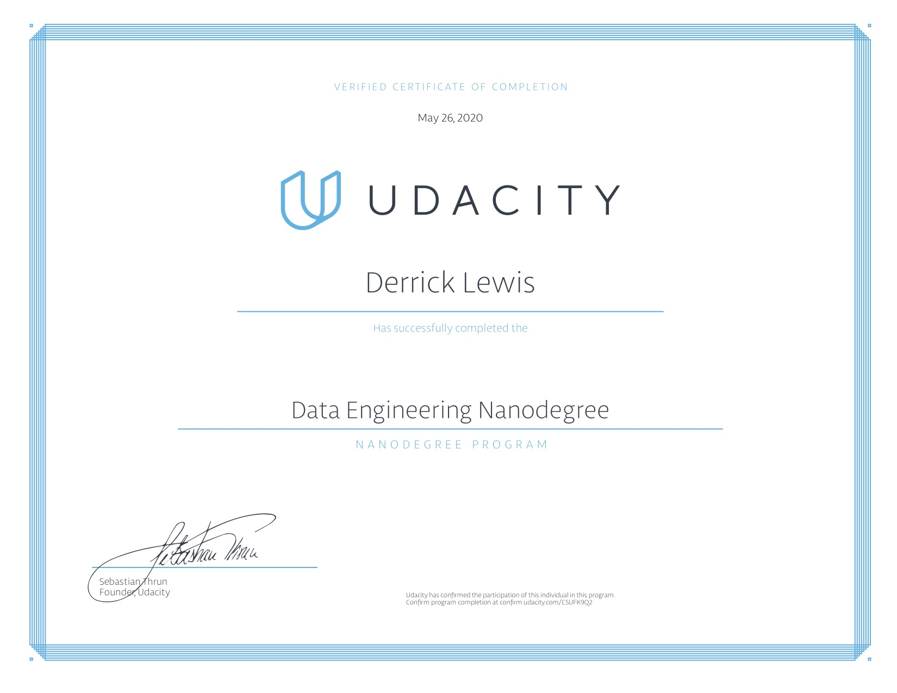

# Udacity-Data-Engineering-Nanodegree

---

Coursework for Udacity's Data Engineering NanoDegree

## Concepts

1. **Data Modeling**

- create relational and NoSQL data models to fit the diverse needs of data consumers. Use ETL to build databases in PostgreSQL and Apache Cassandra.

2. **Data Warehouses**

- Build an ETL pipeline that extracts data from S3, stages them in Redshift, and transforms data into a set of dimensional tables for an analytics team.

3. **Data Lakes**

- Build a data lake and an ETL pipeline in Spark that loads data from S3, processes the data into analytics tables, and loads them back into S3.

4. **Data Pipelines with Airflow**

- Creating and automating a set of data pipelines with Airflow, monitoring and debugging production pipelines

5. **Capstone project** 

- Built data lake, pipeline and data warehouse for a social media ambassador agency

- https://github.com/lewi0332/Data-Pipeline-Capstone-Project

